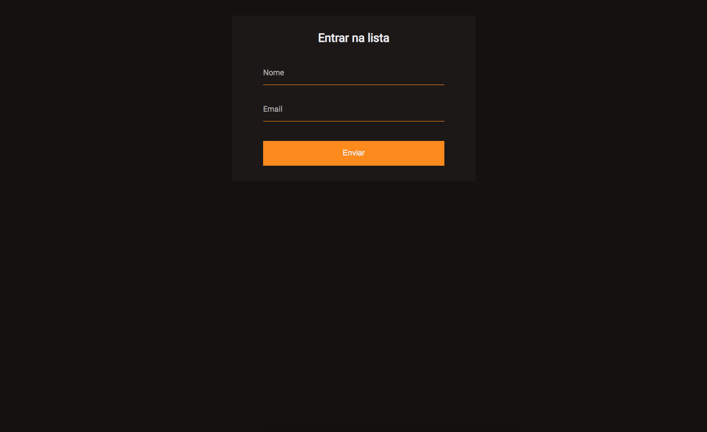

<strong><h1 align="center"># Página - validação de formulário</h1></strong>

## 🚀 Tecnologias
- HTML
- CSS
- JavaScript

## 💻 Projeto
A validação de formulário nos ajuda a garantir que os usuários preencham os campos no formato correto, garantindo que os dados enviados funcionem com êxito em nossos aplicativos.